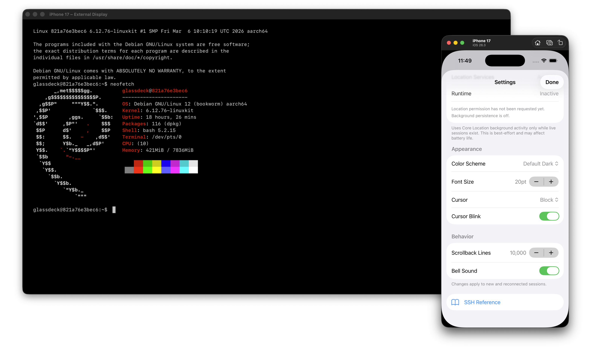

# Glassdeck



A SSH app for iOS built with [GhosttyKit](https://github.com/ghostty-org/ghostty).

[한국어](README-ko.md)

## Features

**Terminal & Shell**

- **SSH terminal sessions**: Full VT100/xterm emulation via GhosttyKit terminal APIs.
- **PTY shell**: Bidirectional async bridge (SSHPTYBridge actor) with runtime resize.
- **Terminal rendering**: Powered by GhosttyKit with Glassdeck-owned surface integration and lifecycle code.
- **Render coalescing**: `scheduleRender()` with UIKit `layoutSubviews` batching to consolidate rapid state changes.
- **Local scrollback**: 10,000 lines default, configurable 1K–100K, Metal-accelerated viewport scrolling.

**Connectivity**

- **Auto-reconnection**: Exponential backoff (5 attempts, 1–30s delay, 2× multiplier), transient vs permanent failure classification.
- **Session persistence & restore**: JSON snapshots to UserDefaults, auto-restore on foreground, optional Core Location background keep-alive.
- **Connection profiles**: CRUD with JSON persistence, password or SSH key auth, notes, last-connected date.
- **TOFU host key verification**: Keychain-backed known_hosts, SHA-256 fingerprints, auto-trust new / reject mismatch.

**Input & Hardware**

- **Hardware keyboard**: 90+ UIKeyCommands (Ctrl+letter, arrows, function keys, Tab, Escape, PageUp/Down, Home/End).
- **Touch/pointer input**: UIPointerInteraction with I-beam cursor, full SGR mouse reporting, drag tracking.
- **IME support** (Experimental): UITextInput with marked text / composing flag.

**Advanced Tools**

- **External display routing**: Dedicated scene delegate, remote pointer overlay, display routing picker.
- **Terminal settings**: Per-display-target profiles (iPhone vs external monitor), 8 color schemes, font size, cursor style, bell.

## Repository Layout

```
Glassdeck/
├── Glassdeck/               iOS app: SwiftUI views, UIKit terminal surface, input handling
│   ├── App/                 App entry, environment, delegates, animation demo
│   ├── Input/               Keyboard, pointer, IME input coordination
│   ├── Models/              Session management, persistence, credentials, background keep-alive
│   ├── Remote/              External display geometry, remote trackpad coordination
│   ├── Scenes/              Main + external display scene delegates
│   ├── SSH/                 SSH session observable model
│   ├── Terminal/            GhosttySurface UIView, Metal renderer, SwiftUI wrapper
│   ├── Views/               All SwiftUI views (connections, terminal, settings, etc.)
│   └── Resources/           Assets.xcassets, AppIcon.icon
├── GlassdeckCore/           Shared library — the single source of truth for SSH, terminal, models
│   ├── Models/              ConnectionProfile, ConnectionStore, AppSettings, RemoteControlMode
│   ├── SSH/                 SSHConnectionManager, SSHPTYBridge, SSHAuthenticator,
│   │                        HostKeyVerifier, SSHReconnectManager, SSHKeyManager, etc.
│   └── Terminal/            GhosttyKitSurfaceIO, TerminalConfiguration (8 themes), TerminalIO, types
├── Frameworks/              GhosttyKit.xcframework (locally materialized dependency artifact)
├── GlassdeckApp.xcodeproj/  Checked-in native Xcode project
├── Scripts/                 Build, run, test automation
├── Tools/
│   └── GlassdeckBuild/      Native host-side build/test orchestration runner
│       ├── Package.swift
│       └── Package.resolved
├── Tests/                   Unit, UI, integration, performance tests
├── Vendor/                  Forked swift-ssh-client dependency
├── Backlogs/                Code review findings and backlog tracking
├── AGENTS.md                Repo-specific workflow rules for Codex and sub-agents
├── LICENSE                  MIT
├── README.md                English documentation
└── README-ko.md             Korean documentation
```

## Architecture

```
SwiftUI Views (ConnectionListView, SessionTabView, TerminalContainerView)
       │
SessionManager (orchestrator — @MainActor, 1082 lines)
SessionLifecycleCoordinator (lifecycle events, persistence, restore)
       │
  ┌────┼────────────────┐
  │    │                 │
SSH Layer       Terminal UI        Input Layer
SSHConnectionManager  GhosttySurface (UIView)  KeyboardInputHandler
SSHAuthenticator      Metal renderer (CI)      PointerInputHandler
SSHPTYBridge          GhosttyKitSurfaceIO        SessionKeyboardInputHost
HostKeyVerifier       TerminalConfiguration    RemoteTrackpadCoordinator
SSHReconnectManager
       │
GlassdeckCore (shared library — only source of truth)
       │
External: GhosttyKit · swift-ssh-client · SwiftNIO SSH · Swift Crypto
```

**Data flow**: User connects → SSHConnectionManager authenticates (password/key) → HostKeyVerifier checks TOFU → shell opened with PTY → SSHPTYBridge bridges shell↔terminal bidirectionally → GhosttyKitSurfaceIO passes VT stream to GhosttyKit → GhosttySurface renders via Metal → Input flows back through VT encoding → shell.

## Terminal Engine

- `GhosttyKitSurfaceIO.swift` — Swift adapter between terminal I/O and GhosttyKit callbacks.
- `GhosttyTerminalView.swift` — UIKit + Metal surface wrapper and input bridge.
- Terminal behavior is powered by `GhosttyKit`.
- The vendored terminal framework should stay in sync with the managed Ghostty source state.

## Vendored Ghostty Build

`Frameworks/GhosttyKit.xcframework` — local dependency artifact used by the checked-in
Xcode project. It is gitignored/untracked by default and materialized as needed.

Build or refresh from managed Ghostty source:

```bash
swift run --package-path Tools/GlassdeckBuild glassdeck-build deps ghostty
```

Common profile:

- `--profile release-fast` for release-like artifacts.
- `--profile debug` (default).

## Development

### Native Xcode workflow

Builds use the checked-in `GlassdeckApp.xcodeproj` and `glassdeck-build` runner:

```bash
swift run --package-path Tools/GlassdeckBuild glassdeck-build build --scheme app
```

### Run on simulator

Build & launch on iOS simulator:

```bash
swift run --package-path Tools/GlassdeckBuild glassdeck-build run --scheme app
```

### Run tests

Unit tests on simulator:

```bash
swift run --package-path Tools/GlassdeckBuild glassdeck-build test --scheme unit
```

Live SSH integration tests vs Docker (auto-starts container, runs smoke checks first):

```bash
swift run --package-path Tools/GlassdeckBuild glassdeck-build test --scheme unit --only-testing "GlassdeckAppTests/Integration.test"
```

Terminal rendering performance tests vs live Docker SSH:

```bash
swift run --package-path Tools/GlassdeckBuild glassdeck-build test --scheme ui --only-testing "GlassdeckAppUITests/TerminalPerformance"
```

Animation rendering performance tests (simulator):

```bash
swift run --package-path Tools/GlassdeckBuild glassdeck-build test --scheme ui --only-testing "GlassdeckAppUITests/Animation"
```

Animation rendering performance tests (device) - requires `DEVICE_ID`:

```bash
swift run --package-path Tools/GlassdeckBuild glassdeck-build test --scheme ui --only-testing "GlassdeckAppUITests/Animation"
```

### Run UI tests

UI tests with screenshot capture + artifact export:

```bash
swift run --package-path Tools/GlassdeckBuild glassdeck-build test --scheme ui --only-testing "GlassdeckAppUITests/..."
```

Verify animations visually render (screenshot diff):

```bash
swift run --package-path Tools/GlassdeckBuild glassdeck-build test --scheme ui --only-testing "GlassdeckAppUITests/AnimationDemo"
```

### Test utilities

Result lookup and artifact inspection from runner output:

```bash
swift run --package-path Tools/GlassdeckBuild glassdeck-build artifacts --command build
swift run --package-path Tools/GlassdeckBuild glassdeck-build artifacts --command test
```

### Common flags
    
| Flag                    | Description                                          |
| ----------------------- | ---------------------------------------------------- |
| `--worker <id>`         | Isolate workspace artifacts for parallel workers       |
| `--scheme <name>`       | Select build/run/test scheme (`app`, `unit`, `ui`)    |
| `--simulator <target>`  | Simulator by name or exact UDID (`iPhone 17` or `48B...`) for run/test paths. Duplicate exact names now fail to avoid ambiguous device selection. |
| `--dry-run`             | Print the computed xcodebuild/utility command only     |
| `--only-testing <target>` | Forward xcodebuild test filtering flags              |

### Simulator target

Default: `iPhone 17` on latest iOS runtime. Prefer explicit UDID with `SIMULATOR_ID=<udid>` or `--simulator <udid>` when scripts run in environments with duplicated names.

### Build artifacts

- `.build/glassdeck-build/logs/<command>/` — raw command logs
- `.build/glassdeck-build/results/<command>/` — xcresult bundles
- `.build/glassdeck-build/artifacts/<command>/latest/` — latest exported artifacts and summary
- `.build/glassdeck-build/derived-data/<worker>/` — worker-scoped DerivedData reuse

**Note**: `GlassdeckApp.xcodeproj` is source-tracked; regenerate scripts are no longer part of normal workflow.

## Docker SSH Test Target

Canonical live test endpoint (replaces separate Raspberry Pi).

**Requirements**: Docker Desktop on Mac.

```bash
swift run --package-path Tools/GlassdeckBuild glassdeck-build docker up
swift run --package-path Tools/GlassdeckBuild glassdeck-build docker down
```

- **Port**: 22222 (default)
- **User**: glassdeck
- **Auth**: Password + Key both enabled

**Seeded home directory**:

- `~/bin/health-check.sh`
- `~/testdata/preview.txt`
- `~/testdata/nested/dir/info.txt`
- `~/testdata/nano-target.txt`
- `~/upload-target/`

**Note**: For physical iPhone testing, iPhone and Mac must be on the same LAN.

## Manual Smoke Checklist

1.  Start Docker SSH: `swift run --package-path Tools/GlassdeckBuild glassdeck-build docker up`
2.  Or run full suite: `swift run --package-path Tools/GlassdeckBuild glassdeck-build test --scheme unit --only-testing "GlassdeckAppTests/Integration.test"`
3.  Launch app on simulator or iPhone
4.  Create profile with printed host/port, connect via password auth
5.  Create second profile or switch to SSH key auth
6.  Run `~/bin/health-check.sh`, `pwd`, `ls ~/testdata`
7.  Verify rendering, typing, paste, special keys, resize, disconnect, reconnect
8.  With external monitor + physical keyboard: route session, test Mouse/Cursor mode, two-finger scroll, View Local Terminal, `nano --mouse ~/testdata/nano-target.txt`

## Dependencies

| Dependency       | Source                                       | Purpose                        |
| ---------------- | -------------------------------------------- | ------------------------------ |
| GhosttyKit       | `Frameworks/GhosttyKit.xcframework` (materialized locally, untracked) | Terminal + rendering engine    |
| swift-ssh-client | Vendor/ (fork)       | High-level SSH client          |
| swift-nio-ssh    | SPM (≥0.9.0)         | Low-level SSH protocol         |
| swift-nio        | SPM (≥2.65.0)        | Async networking               |
| Swift Crypto     | (via NIO SSH)        | Ed25519/P256 keys, SHA-256     |
| Core Location    | System               | Optional background keep-alive |

## Notes

- GlassdeckCore is the only source of truth for shared SSH, key, model, and terminal logic.
- Terminal implementation is centered on GhosttyKit and a local host-side materialized xcframework.
- `glassdeck-build deps ghostty` refreshes that dependency artifact when needed.
- Docker SSH server is the canonical acceptance target.

## License

MIT — see [LICENSE](LICENSE).
